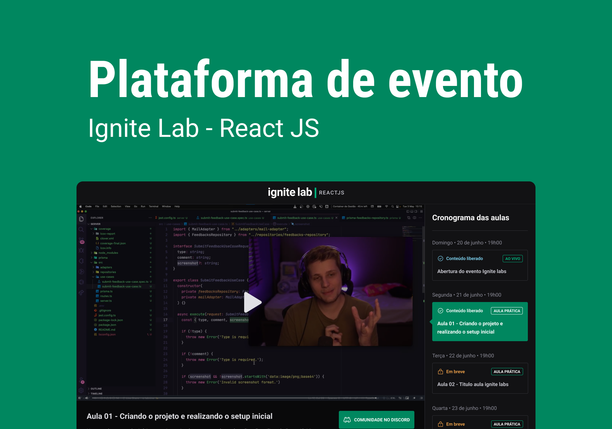

<h1 align="center">Plataforma Ignite Lab </h1>

 Uma plataforma de conteúdos em vídeo.  

  <a href="#-tecnologias">Tecnologias</a>&nbsp;&nbsp;&nbsp;|&nbsp;&nbsp;&nbsp;
  <a href="#-layout">Layout</a>&nbsp;&nbsp;&nbsp;|&nbsp;&nbsp;&nbsp;
   <a href="#-vercel">Ignite Lab vercel.app</a>&nbsp;&nbsp;&nbsp;|&nbsp;&nbsp;&nbsp;
  <a href="#memo-licença">Licença</a>

  

 

  

## 🚀 Tecnologias

Esse projeto foi desenvolvido com as seguintes tecnologias:

- HTML
- React
- Typescript
- Tailwind CSS
- Phosphor Icons
- Figma
- Date-fns
- Graphql
- Apollo Server
- Hygraph
- React Player
- React Router

## 🔖 Layout

Você pode visualizar o layout do projeto através [DESSE LINK](https://www.figma.com/community/file/1120711251998877938/Plataforma-de-Evento---Ignite-Lab). É necessário ter conta no [Figma](https://figma.com) para acessá-lo.

## 🔖 Vercel

Você pode visualizar o projeto na vercel através [DESSE LINK](https://ignite-lab-flame-kappa.vercel.app/).

---

## :memo: Licença

Esse projeto está sob a licença MIT.

